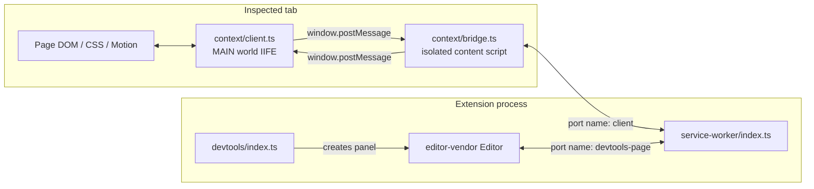
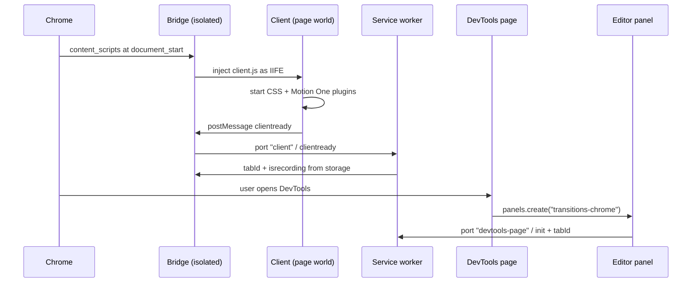
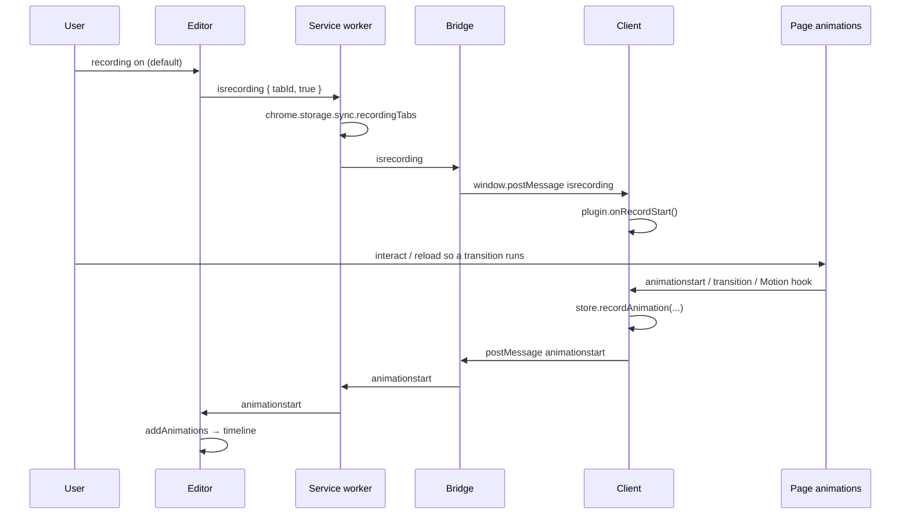
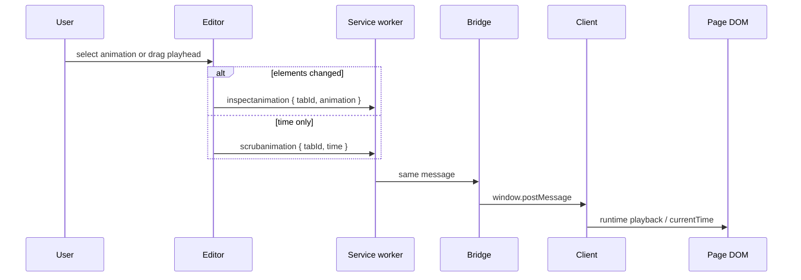
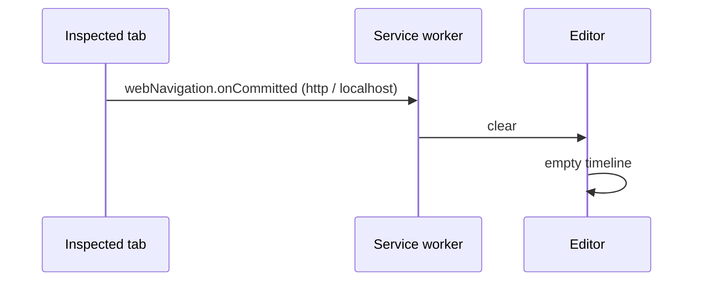
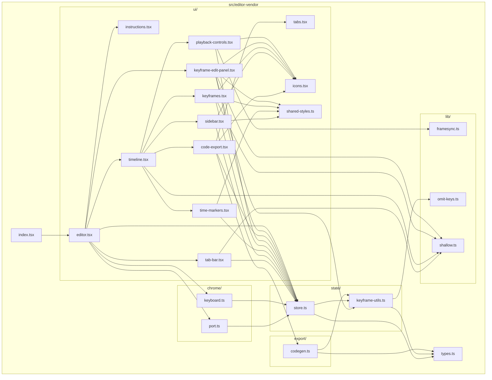

# transitions-chrome

Chrome DevTools extension for inspecting, scrubbing, and exporting page transitions. The long-term goal is a single panel that can compare how different animation stacks move the same UI — **Motion**, **GSAP**, **react-spring**, and CSS — without switching tools.

This repo is a TypeScript + Vite rebuild of Motion DevTools `2.0.0`, renamed so it can sit beside the store extension. Recording today covers CSS animations, CSS transitions, and Motion One (`window.__MOTION_DEV_TOOLS_RECORD`). Other libraries are the next detection targets.

## Table of contents

- [Why this exists](#why-this-exists)
- [What it does today](#what-it-does-today)
- [Application structure](#application-structure)
  - [Runtime roles](#runtime-roles)
  - [Source tree](#source-tree)
- [Execution flows](#execution-flows)
  - [Worlds and connections](#worlds-and-connections)
  - [Startup and injection](#startup-and-injection)
  - [Record a transition](#record-a-transition)
  - [Inspect and scrub](#inspect-and-scrub)
  - [Reload](#reload)
- [Editor structure](#editor-structure)
- [Build and run in the browser](#build-and-run-in-the-browser)
  - [Prerequisites](#prerequisites)
  - [Install](#install)
  - [Development build](#development-build)
  - [Production build](#production-build)
  - [Load the unpacked extension](#load-the-unpacked-extension)
  - [Open the DevTools panel](#open-the-devtools-panel)
  - [Record something](#record-something)
  - [Reload after code changes](#reload-after-code-changes)
  - [Troubleshooting](#troubleshooting)
- [Scripts](#scripts)

## Why this exists

Animation libraries expose different timing models, easing formats, and element hooks. Comparing them in the browser usually means opening each library’s own debugger — or none at all.

`transitions-chrome` is a lab for that comparison:

| Stack | Intent |
| --- | --- |
| CSS animations / transitions | Web Animations API on the element |
| Motion (Motion One today; Motion for React later) | Page hook `__MOTION_DEV_TOOLS_RECORD` |
| GSAP | Planned: detect tweens / timelines on the inspected page |
| react-spring | Planned: detect spring-driven values |

The DevTools panel is the shared timeline. Page detection lives in `src/context/plugins/` so a new library can be added without rewriting the editor.

## What it does today

- Records CSS `@keyframes` animations and CSS transitions on the inspected page
- Records Motion One animations that call `window.__MOTION_DEV_TOOLS_RECORD`
- Shows a timeline in a DevTools panel named **transitions-chrome**
- Lets you select keyframes, edit values / easings, play, and scrub
- Exports the selected animation as Motion One, CSS animation, or CSS transition
- Clears the timeline when the inspected tab reloads

The panel UI is TypeScript under `src/editor-vendor` and still runs **React 17.0.2** (same major version as the original bundle). React will be upgraded later.

## Application structure

Four Chrome worlds cooperate. They never share a JavaScript heap, so they talk through `chrome.runtime` ports and `window.postMessage`.

### Runtime roles

| Piece | Chrome world | Entry | Job |
| --- | --- | --- | --- |
| Service worker | Extension background | `src/service-worker/index.ts` | Owns ports, recording flags in `chrome.storage.sync`, forwards messages, clears the timeline on navigation |
| Bridge | Isolated content script | `src/context/bridge.ts` | Injects the page client as a classic IIFE and relays `window.postMessage` ↔ background |
| Client | Page (MAIN) world | `src/context/client.ts` | Sees real DOM animations, runs record plugins, plays back inspect / scrub |
| DevTools page | Extension DevTools | `src/devtools/index.ts` | Registers the **transitions-chrome** panel |
| Editor | DevTools panel iframe | `src/editor/index.html` → `src/editor-vendor` | Timeline, recording toggle, export, keyframe editing |

The client **must** stay a classic IIFE (`?script&iife`). An ES module in the page world cannot reliably hook CSS / Motion on arbitrary sites.

### Source tree

```
src/
  shared/                 Cross-world types (animations + message union)
    types.ts
    messages.ts

  service-worker/         Manifest V3 background worker
    index.ts

  context/                Scripts that run against the inspected page
    bridge.ts             Isolated: inject client, relay messages
    client.ts             Page-world bootstrap
    store.ts              Recording / inspect state (zustand vanilla)
    recording.ts          Plugin start/stop + flush to the bridge
    messages.ts           Page-world handlers for isrecording / inspect / scrub
    inspect.ts            Apply an inspected animation to the DOM
    element-id.ts         Stable data-motion-id on recorded elements
    plugins/
      css-animation.ts    CSSAnimation via animationstart
      css-transition.ts   CSSTransition via transitionrun / transitionstart
      motion-one.ts       Sets / clears __MOTION_DEV_TOOLS_RECORD
    runtime/              Playback used when the panel scrubs
      animate-style.ts
      style.ts
      easing.ts
      utils.ts

  devtools/               chrome.devtools.panels.create(...)
    index.html
    index.ts

  editor/                 Panel shell (HTML, fonts, CSS)
    index.html            #app mount + main.ts
    main.ts
    styles.css

  editor-vendor/          Typed panel UI (React 17)
    index.tsx             ReactDOM.render(<Editor />, #app)
    types.ts
    state/                Editor store, undo, keyframe helpers
    chrome/               Port to the service worker + keyboard shortcuts
    export/               Codegen for Motion One / CSS
    lib/                  omitKeys, rAF framesync, shallow compare
    ui/                   Timeline, sidebar, export modal, Leva panel

public/
  icons/                  Toolbar / store icons
  vendor/                 Original editor.bundle.js (reference only, not loaded)

manifest.config.ts        MV3 manifest consumed by @crxjs/vite-plugin
vite.config.ts
```

Shared contracts live in `src/shared` so the service worker, page scripts, and panel stay aligned on message `type` strings (`init`, `clientready`, `animationstart`, `isrecording`, `inspectanimation`, `scrubanimation`, `clear`).

## Execution flows

### Worlds and connections



### Startup and injection



### Record a transition



### Inspect and scrub



### Reload



The page client also posts `animationstart` through `chrome.runtime.sendMessage` as a fallback; the service worker forwards that to the open DevTools port when one exists.

## Editor structure

`src/editor-vendor` is the DevTools panel application: a TypeScript port of the original `editor.bundle.js` UI, still on **React 17**. `src/editor/main.ts` imports it after fonts and CSS; `index.tsx` mounts `<Editor />` into `#app` with `ReactDOM.render`.

Folders split by job, not by file size:

| Folder | Role |
| --- | --- |
| *(root)* | `index.tsx` mounts the app; `types.ts` is the editor store and keyframe contract |
| `state/` | Zustand vanilla store, undo/redo history, keyframe timing helpers |
| `chrome/` | `devtools-page` port (record / inspect / scrub / clear) and keyboard shortcuts |
| `export/` | Turn the selected animation into Motion One or CSS source |
| `lib/` | Small utilities: `omitKeys`, rAF framesync for playback, shallow equality |
| `ui/` | React views: empty state, tab bar, timeline chrome, export modal, Leva keyframe panel |

`ui/` is composed as a tree. `editor.tsx` always renders the tab bar and the keyframe panel; it swaps `Instructions` for `Timeline` once animations exist. `Timeline` owns the sidebar, time markers, keyframe tracks, playback controls, and the export overlay.



## Build and run in the browser

The UI is a **DevTools panel**, not a normal tab. Vite’s `http://localhost:5173` preview will not show a working timeline: `chrome.runtime` and `chrome.devtools` only exist after Chrome loads the unpacked extension.

### Prerequisites

- [Node.js](https://nodejs.org/) 20 or newer
- [pnpm](https://pnpm.io/) 10 (this repo’s lockfile is pnpm)
- Google Chrome or another Chromium browser (Edge works the same way)
- A page that actually animates (CSS transition/animation, or Motion One)

### Install

From the repo root:

```bash
pnpm install
```

### Development build

```bash
pnpm dev
```

Vite + `@crxjs/vite-plugin` serve the extension with source maps. Leave this process running. Chrome still needs the unpacked load step below; CRXJS then hot-updates background / content / panel files. After a manifest or service-worker change, click **Reload** on `chrome://extensions`.

Dev server: `http://localhost:5173` (strict port). Do not use that URL as the app — load `dist/` (or the CRXJS unpacked output the terminal prints) in Chrome.

### Production build

```bash
pnpm build
```

This typechecks (`tsc -b`) and writes an unpacked MV3 extension to `dist/`.

### Load the unpacked extension

1. Open `chrome://extensions`
2. Turn on **Developer mode** (top right)
3. Click **Load unpacked**
4. Select this folder:
   - after `pnpm build`: `dist/`
   - while `pnpm dev` is running: the unpacked directory CRXJS reports (often still `dist/` once a build has been written)
5. Confirm the card named **transitions-chrome** is enabled
6. Pin the extension if you want the toolbar icon visible (the UI is still the DevTools panel, not a popup)

Chrome assigns a new extension ID because this project has no original store `key`. That is expected.

### Open the DevTools panel

1. Go to the page you want to inspect (any `http`, `https`, or `file` URL)
2. Open DevTools (`F12` or `Ctrl+Shift+I` / `Cmd+Option+I`)
3. Open the **transitions-chrome** tab
   - If it is hidden: DevTools overflow **»** → **transitions-chrome**
4. You should see the record control and the empty-state copy: interact with or reload the page while recording is active

If the panel is missing, the extension is not loaded or DevTools was opened before the extension was enabled. Close DevTools, reload the extension, open DevTools again.

### Record something

1. Leave **recording** on (red record control in the panel)
2. In the inspected tab, trigger a transition (hover, class toggle, route change, Motion One `animate(...)`)
3. Animation names appear as tabs; the timeline shows elements and value tracks
4. Click a keyframe diamond to edit it in the right-hand Leva panel
5. Use the play / skip-back controls or drag the playhead to scrub the page
6. **Export** generates Motion One or CSS for the selected animation

Keyboard (when no input is focused):

| Key | Action |
| --- | --- |
| `Space` | Play / pause |
| `Shift+Space` | Restart from `0` and play |
| `Escape` | Close export |
| `Ctrl+Z` / `Cmd+Z` | Undo |
| `Ctrl+Shift+Z` / `Cmd+Shift+Z` | Redo |

### Reload after code changes

| What you changed | What to do |
| --- | --- |
| Panel UI (`src/editor-vendor`, `src/editor`) | `pnpm dev` often refreshes the panel; if not, close and reopen DevTools |
| Page client / bridge (`src/context`) | Reload the **inspected tab** so the content script injects again |
| Service worker (`src/service-worker`) | **Reload** the extension on `chrome://extensions`, then reopen DevTools |
| `manifest.config.ts` | Reload the extension, then reopen DevTools |
| After `pnpm build` | Reload the extension so Chrome picks up a new `dist/` |

A committed navigation on `http` / `localhost` also sends `clear` to the panel.

### Troubleshooting

**Panel is blank or throws `chrome is not defined`**  
You opened `src/editor/index.html` or the Vite URL in a normal tab. Load the unpacked extension and open the panel from DevTools.

**Nothing appears on the timeline**  
Recording is off; the page did not run a CSS or Motion One animation; or the client did not inject (reload the tab after enabling the extension). Hard-refresh the page with DevTools open.

**Motion for React / GSAP / react-spring animations are missing**  
Only CSS and Motion One are wired in `src/context/plugins/`. Add a plugin there and register it in `src/context/recording.ts`.

**Two Motion panels**  
Disable the store “Motion DevTools” extension if both are installed. This project’s tab is labeled **transitions-chrome**.

**`pnpm dev` port already in use**  
The config uses `strictPort: true` on `5173`. Stop the other process or change `server.port` in `vite.config.ts`.

**Icons or client script 404**  
Rebuild (`pnpm build`) and reload the extension. The page client is exposed as a web-accessible IIFE; the bridge injects it with `chrome.runtime.getURL`.

## Scripts

| Command | Result |
| --- | --- |
| `pnpm install` | Install dependencies |
| `pnpm dev` | Vite + CRXJS watch, source maps on |
| `pnpm build` | `tsc -b` then production unpacked extension in `dist/` |
| `pnpm preview` | Vite preview only — not a substitute for loading the extension |
