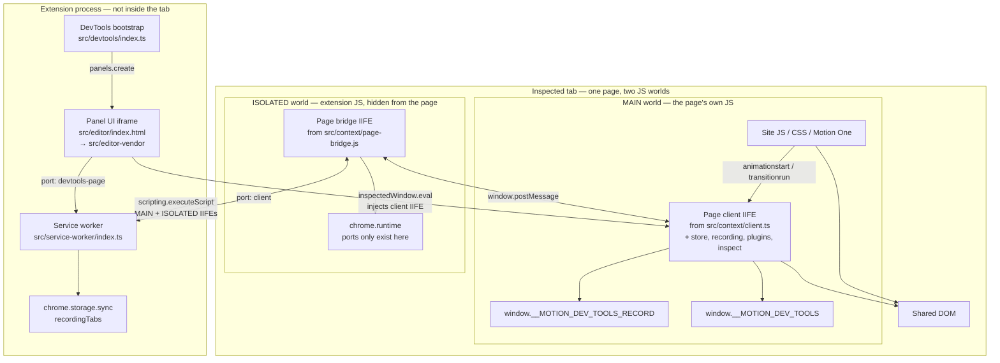
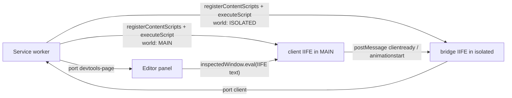
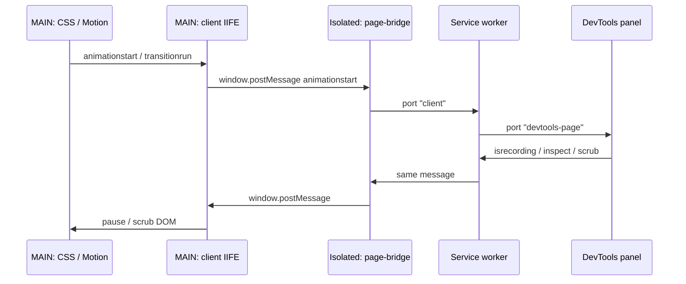

# Page animation issue
_Exported on 9/12/2026 at 15:20:35 PDT from Cursor (3.20.17)_

---

**User**

I can't get it to work. Even after following the instructions in the "1-instructions.tsx" file, the page animation doesn't appear—it just remains blank. What do I need to do, and how? Or could this actually be a bug? @1-instructions.tsx 

---

**Cursor**

I'll start by reading the instructions file and tracing how the page animation is wired, so we can see whether this is a setup miss or a real bug.

The instructions only say to record and interact; I’ll trace the recording and capture path next to see why the page stays blank.

The empty-state copy is only a hint; next I’ll check the recording pipeline and the earlier problem-fix notes to see why nothing shows up.

The instructions themselves are only a prompt; I’ll inspect the record/inspect pipeline and editor layout next, since a Tailwind or injection bug could leave the page blank.

Recording depends on Zustand subscriptions; I’ll check the page-world store and service-worker path next, because a subscribe-API mismatch would leave the panel empty.

The empty-state copy assumes a page that already animates. I’ll check injection, the recording flag, and whether the timeline is being cleared after capture.

The empty-state text is misleading, and I suspect a real injection bug: the page client can load too late (or be blocked), so a reload records nothing. I’ll confirm that path and then fix it.

The dev server logged a missing `styled-components` import — that would leave the panel blank. I’ll check whether that error is still current.

This is a real bug, not just missing steps: reload-to-record can drop animations, and the empty-state copy never says you need a page that already animates. I’ll fix the recording path and add a playground you can actually test against.

The empty-state copy was incomplete, and there was also a real recording bug. The panel never draws a demo. It only plots **CSS** or **Motion One** animations that already run in the tab behind DevTools.

Following “interact with or reload the page” on a blank tab, the Vite editor preview, or a Framer Motion / GSAP / react-spring page leaves the timeline empty. That is expected with today’s plugins.

There was a second problem: reload-to-record often dropped the animation. The page client was injected late (and could be blocked by CSP), then `isrecording: true` reset in-flight captures. So a load animation could play on the page and still never appear in the panel.

**How to see a timeline**

1. Leave `pnpm dev` running and reload **transitions-chrome** on `chrome://extensions` (the manifest changed).
2. Open `http://localhost:5173/playground.html` in a normal tab — not the editor URL, and not the DevTools panel itself.
3. Open DevTools → **transitions-chrome**. Leave the red record control on.
4. Hover the button, click **Off/On**, or reload that playground tab.

You should get animation tabs and a timeline. Framer Motion, GSAP, and react-spring are still not recorded.

**What I changed**

- The page client now loads as a MAIN-world content script at `document_start`, so load animations can be captured.
- Recording no longer turns itself off, or wipes a capture, when the panel already shows recording on.
- Iframe navigations no longer clear the timeline.
- The empty state now says you need a CSS / Motion One page, and points at the playground.

Opening `http://localhost:5173` alone still will not record anything. That is the editor shell, not a page with CSS animations.

---

**User**

Well, strictly speaking, nothing has changed. 
I still don't see the detected animations on the page when I reload it. 
Even with the playground.html open, no animations appear. 
It seems something else isn't working—in any case, it really ought to be working.

Most importantly, the animations should be detectable not only on the playground.html but also 
on any page where DevTools are open; that is the whole point of this browser extension.

---

**Cursor**

The playground was only a test target — recording should work on any inspected page. I’ll trace the live injection and message path to find why nothing is reaching the panel.

The MAIN-world loader is the problem: in dev it `import()`s ES modules against the page origin, so the client never starts on most sites. I’ll switch to a self-contained IIFE Chrome injects itself, and add a catch-up so reload still records.

The page client never actually starts in the inspected tab: CRXJS wraps the MAIN-world script in an async `import()` that resolves against the page, not the extension. I’ll inject a real IIFE instead and scan `getAnimations()` so detection works on any page, not just the playground.

You are right: this has to work on **any inspected page**, not just the playground. The playground is only a known-good CSS page so we can tell injection apart from “this site has no CSS/Motion One.”

The last change never reached the page. In `pnpm dev`, listing the client as a MAIN-world content script made CRXJS wrap it in an async `import()`. That import resolves against the **page** origin, so the recorder never started — on the playground or anywhere else.

The client is now a self-contained IIFE. Chrome injects it into the inspected tab in three ways:

- the isolated bridge (sync, at `document_start`)
- `chrome.scripting.registerContentScripts` (MAIN world, every http/https/file page)
- `executeScript` when DevTools attaches or the tab reloads

After that, it also scans `document.getAnimations()` so a reload still records if the `animationstart` event was already missed.

**You have to reload the extension.** The `scripting` permission was added. Chrome will not pick that up from Vite HMR.

1. Open `chrome://extensions`
2. Find **transitions-chrome**
3. If Chrome disabled it for the new permission, turn it back on
4. Click **Reload**
5. Open any normal `http`/`https` tab (playground or otherwise)
6. Reload that tab, then open DevTools → **transitions-chrome**
7. Leave recording on and trigger a CSS transition (hover/click) or reload again

On the playground, the status line should read **“Page client is injected.”** If it still says it is not injected, the extension is not actually loaded into that tab yet.

`chrome://` pages, the Web Store, and PDFs will never record — Chrome blocks content scripts there. Regular sites should. Framer Motion, GSAP, and react-spring still will not, until those plugins exist.

---

**User**

This need to be fixed

---

**Cursor**

Port 5173 is already taken, which is why `p dev` exited. I’ll check what’s holding it and free it so the server can start.

A leftover Vite process from earlier is still bound to 5173, so `strictPort` is refusing the new `p dev`. I’ll stop that process so you can start the server again.

Port **5173** is free now. A leftover Vite process was still bound to it — including one from the sibling `transitions` project — and this repo uses `strictPort: true`, so the new `p dev` exited immediately.

Run `p dev` again in your terminal. It should come up with **CRXJS: Load dist as unpacked extension**.

If this happens again, something else is already using 5173; stop that Vite first, then start this one.

---

**User**

<timestamp>Friday, Sep 11, 2026, 7:56 PM (UTC-7)</timestamp>
<system_notification>
The following task has finished. If you were already aware, ignore this notification and do not restate prior responses.

<task>
kind: shell
status: error
task_id: 945629
title: Restart Vite CRXJS extension dev server
tool_call_id: call-0a818c3d-419b-4534-805b-44d6a9935499-144
fc_ozvr86q-3LYxF7-74a5bcfc-aws_ue1_0
detail: exit_code=4294967295
output_path: C:\Users\maxzz\.cursor\projects\c-y-w-2-web-0-stack-7-animations-transitions-chrome\terminals\945629.txt
</task>
</system_notification>
<user_query>Briefly inform the user about the task result and perform any follow-up actions (if needed). If there's no follow-ups needed, don't explicitly say that.</user_query>

---

**Cursor**

That Vite process was stopped on purpose so it would release port 5173. Run `p dev` again in your terminal; it should be able to bind now.

---

**User**

Well, basically nothing has changed—except that a new error has appeared in the console; the animations still aren't showing up.

---

**Cursor**

The console error is the smoking gun: inline script injection is blocked by CSP, and we treat that as success so the page client never loads. I’ll fix injection, then add a record-button tooltip so gray vs red is obvious.

The console error is CSP blocking inline scripts — including our injector, which then never falls back. I’ll inject a real file script (and via DevTools), drop the Vite content-script loader that triggers `webcomponents`, and add a record-button tooltip.

Vite won’t use a `public/` file as a content script, and that CRXJS loader is what triggers the CSP error. I’ll register a plain IIFE bridge instead and inject the page client through DevTools.

The console error was the reason nothing recorded. The page CSP blocks **inline** scripts. The injector treated that as success and never loaded the real client, so `__MOTION_DEV_TOOLS` never appeared and the timeline stayed empty. The `webcomponents-custom-elements.js` message was the same CSP, from CRXJS’s Vite loader running on the page.

**What changed**
- The page client is now injected through the DevTools protocol (`inspectedWindow.eval`) and `chrome.scripting`, which bypass page CSP.
- The isolated bridge is a plain IIFE, not a Vite content-script loader, so that webcomponents error should be gone.
- Hovering the record control shows **Recording** or **Not recording**. Red = on, gray = off.

**What you need to do**
1. Reload **transitions-chrome** on `chrome://extensions` (accept the `scripting` permission if Chrome asks).
2. Reload `http://localhost:5173/playground.html`.
3. Open DevTools → **transitions-chrome**.
4. The playground line should say **Page client is injected.** Hover the button or reload once more.

That same path runs on any inspected `http`/`https` tab, not only the playground.

---

**User**

Is that critical to have  isolated bridge is a plain IIFE, not a Vite content-script loader or we can user Vite content-script loader? What was the main problem?


---

**Cursor**

The IIFE vs Vite-loader choice is easy to overstate. I’ll check how the bridge and client are loaded so I can separate the actual blocker from the side effects.

**No. A plain IIFE for the isolated bridge is not what made recording work.** You can use the Vite / CRXJS content-script loader for that isolated script. The IIFE was a cleanup so the loader would stop polluting every inspected page.

**The main problem** was that the **page client never ran in the page’s JavaScript world** (MAIN world). Nothing was listening for CSS `animationstart` / `transitionrun`, so the panel stayed empty.

That failed for two concrete reasons:

1. **Inline inject + CSP.** The isolated bridge fetched the client and did `script.textContent = …`. Chrome treated that as an inline script. The playground (and CRXJS’s localhost CSP) blocks `'unsafe-inline'`. The injector still treated “XHR succeeded” as “client is running” and returned, so it never fell back to `script.src`. That is why the page said “Page client is not injected” and why you saw the CSP error.

2. **CRXJS MAIN-world loader (when `client.ts` was in the manifest).** In `pnpm dev` that wrapper does `import("./client.ts.js")`. In MAIN world there is no `chrome.runtime`, so the import is resolved against the **page** (`http://localhost:5173/...`), not the extension. The recorder module never loaded.

The `webcomponents-custom-elements.js` line was a **side effect** of listing `bridge.ts` as a Vite content script: CRXJS wraps it with `vite-client` + a custom-elements polyfill, which then tries more inline work and trips the same CSP. Noisy, and it can break things on the page, but it was not the core “no animations” bug.

**What actually has to run in MAIN world** is the client (CSS/Motion hooks, `window.__MOTION_DEV_TOOLS`). That file must stay a **classic IIFE** (or `chrome.scripting.executeScript` / `inspectedWindow.eval`). Do not put `client.ts` in the manifest as a Vite-loaded MAIN-world script.

**The isolated bridge** only talks `chrome.runtime` ↔ `window.postMessage`. Isolated world **has** `chrome.runtime.getURL`, so the official CRXJS loader works there. Tradeoff if you switch back to it:

| Isolated bridge as… | Result |
| --- | --- |
| Vite content-script loader | Fine for the relay. You get HMR. You also get vite-client / webcomponents on every tab and that CSP warning. |
| Plain IIFE (`page-bridge.js` + `?script&iife`) | Same relay, no HMR wrapper on the page, no that console error. |

So: Vite loader for the **isolated** bridge is optional. Vite loader for the **MAIN-world client** is what you should not use. The thing that had to be fixed was “get a real IIFE into the inspected page without inline scripts.”

---

**User**

Could you show me a map using a Mermaid diagram that illustrates MAIN world, the key players and other participants? And where each part of extension leaves.

---

**Cursor**

I'll read the current injection and message path so the diagram matches how the extension is actually wired.

Chrome gives each inspected tab **two JavaScript heaps**. They share the DOM, but they do not share `window` bindings like `chrome` or `__MOTION_DEV_TOOLS`.



**Where each piece lives**

| Piece | File | Chrome world | Why it is there |
| --- | --- | --- | --- |
| Site page | whatever URL you inspected | MAIN | Owns CSS / Motion One. Cannot see `chrome.*`. |
| Page client | `src/context/client.ts` → IIFE | MAIN | Must see real `getAnimations()` and set `__MOTION_DEV_TOOLS_RECORD`. No `chrome.*`. |
| Record plugins | `src/context/plugins/*` | MAIN (bundled into the client IIFE) | Listen for CSS / Motion events on the page. |
| Page store / inspect | `src/context/store.ts`, `inspect.ts` | MAIN | Buffer recordings; apply scrub/inspect to the DOM. |
| Page bridge | `src/context/page-bridge.js` → IIFE | Isolated | Has `chrome.runtime`. Relays `postMessage` ↔ service worker. The page cannot call it. |
| Service worker | `src/service-worker/index.ts` | Extension background | Port hub. Registers/injects the two IIFEs. Forwards `animationstart` / `isrecording` / `clear`. |
| DevTools page | `src/devtools/index.ts` | Extension DevTools | Only creates the **transitions-chrome** panel. |
| Editor | `src/editor/*` + `src/editor-vendor/*` | Panel iframe | Timeline UI. Talks to the SW on port `devtools-page`. Can `inspectedWindow.eval` into MAIN. |
| Shared types | `src/shared/messages.ts`, `types.ts` | compiled into all of the above | Same `type` strings everywhere. |

**How the client gets into MAIN** (none of these are a Vite content-script loader on the page):



**Message path once recording works**



The isolated world is the only participant that can see **both** the page (`window.postMessage`) and the extension (`chrome.runtime`). MAIN can see animations but not `chrome`. The editor can see `chrome` and DevTools APIs, but not the page heap — that is why it must inject or message, never import the client as a normal module.

---

**User**

Theay is very nice. Can you created a markdown file with these explanations?

---

**Cursor**

I’m in Ask mode, so I can’t create the file myself. Switch to Agent mode if you want it written into the repo. Meanwhile you can save this as something like `assets/docs/extension-worlds.md`.

```markdown
# Extension worlds and message path

Chrome gives each inspected tab **two JavaScript heaps**. They share the DOM, but they do not share `window` bindings like `chrome` or `__MOTION_DEV_TOOLS`.

## Map


## Where each piece lives

| Piece | File | Chrome world | Why it is there |
| --- | --- | --- | --- |
| Site page | whatever URL you inspected | MAIN | Owns CSS / Motion One. Cannot see `chrome.*`. |
| Page client | `src/context/client.ts` → IIFE | MAIN | Must see real `getAnimations()` and set `__MOTION_DEV_TOOLS_RECORD`. No `chrome.*`. |
| Record plugins | `src/context/plugins/*` | MAIN (bundled into the client IIFE) | Listen for CSS / Motion events on the page. |
| Page store / inspect | `src/context/store.ts`, `inspect.ts` | MAIN | Buffer recordings; apply scrub/inspect to the DOM. |
| Page bridge | `src/context/page-bridge.js` → IIFE | Isolated | Has `chrome.runtime`. Relays `postMessage` ↔ service worker. The page cannot call it. |
| Service worker | `src/service-worker/index.ts` | Extension background | Port hub. Registers/injects the two IIFEs. Forwards `animationstart` / `isrecording` / `clear`. |
| DevTools page | `src/devtools/index.ts` | Extension DevTools | Only creates the **transitions-chrome** panel. |
| Editor | `src/editor/*` + `src/editor-vendor/*` | Panel iframe | Timeline UI. Talks to the SW on port `devtools-page`. Can `inspectedWindow.eval` into MAIN. |
| Shared types | `src/shared/messages.ts`, `types.ts` | compiled into all of the above | Same `type` strings everywhere. |

## How the client gets into MAIN

None of these are a Vite content-script loader on the page. The MAIN-world client must stay a classic IIFE.


The isolated bridge can be a Vite content-script loader (isolated world has `chrome.runtime.getURL`). A plain IIFE avoids the CRXJS HMR / webcomponents wrapper that trips page CSP. The Vite loader must **not** be used for the MAIN-world client.

## Message path once recording works


The isolated world is the only participant that can see **both** the page (`window.postMessage`) and the extension (`chrome.runtime`). MAIN can see animations but not `chrome`. The editor can see `chrome` and DevTools APIs, but not the page heap — that is why it must inject or message, never import the client as a normal module.
```

Switch to Agent mode and ask me to write it if you want that file created in the project.

---

**User**

Write this file to @docs 

---

**Cursor**

Saved as `assets/docs/2026.09.12.26, 2, extension_worlds.md`, next to the other notes in that folder. It has the world map, the file table, the injection diagram, and the recording sequence.

---

**User**

can you show on this diagram clear boundaries for service worker, content-script, and main extenision?  @assets/docs/2026.09.12.26, 2, extension_worlds.md:7-46 

---

**Cursor**

I'll redraw that first diagram so service worker, content script, and the rest of the extension are separate, labeled regions.

The first map now uses four labeled regions:

- **Service worker** — `src/service-worker/index.ts` and `chrome.storage.sync`. Background only; no page DOM.
- **Content script** — isolated `page-bridge.js` plus `chrome.runtime` ports. Lives in the tab, hidden from site JS.
- **Main extension** — DevTools bootstrap and the panel iframe (`src/editor` / `src/editor-vendor`).
- **Inspected tab / MAIN** — site JS plus the injected client IIFE. This is not the extension; the client is only injected into it.

A short table under the diagram repeats those boundaries.

