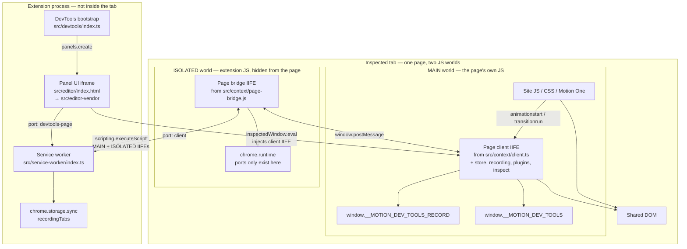
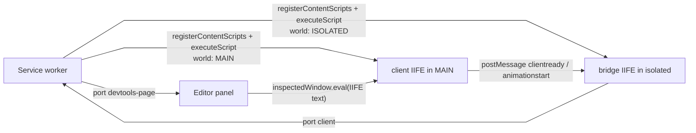
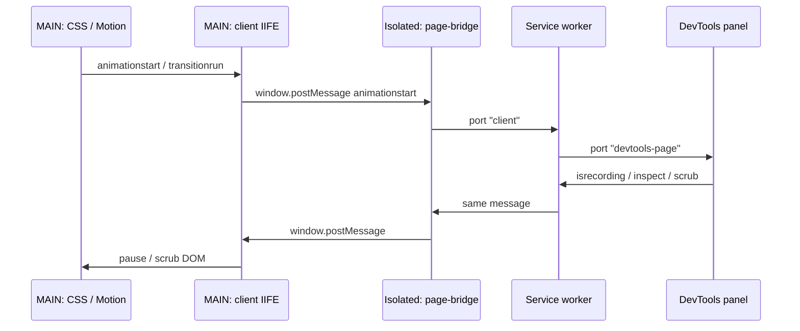

# Extension worlds and message path

Chrome gives each inspected tab **two JavaScript heaps**. They share the DOM, but they do not share `window` bindings like `chrome` or `__MOTION_DEV_TOOLS`.

## Map

## Where each piece lives

| Piece | File | Chrome world | Why it is there |
| --- | --- | --- | --- |
| Site page | whatever URL you inspected | MAIN | Owns CSS / Motion One. Cannot see `chrome.*`. |
| Page client | `src/context/client.ts` → IIFE | MAIN | Must see real `getAnimations()` and set `__MOTION_DEV_TOOLS_RECORD`. No `chrome.*`. |
| Record plugins | `src/context/plugins/*` | MAIN (bundled into the client IIFE) | Listen for CSS / Motion events on the page. |
| Page store / inspect | `src/context/store.ts`, `inspect.ts` | MAIN | Buffer recordings; apply scrub/inspect to the DOM. |
| Page bridge | `src/context/page-bridge.js` → IIFE | Isolated | Has `chrome.runtime`. Relays `postMessage` ↔ service worker. The page cannot call it. |
| Service worker | `src/service-worker/index.ts` | Extension background | Port hub. Registers/injects the two IIFEs. Forwards `animationstart` / `isrecording` / `clear`. |
| DevTools page | `src/devtools/index.ts` | Extension DevTools | Only creates the **transitions-chrome** panel. |
| Editor | `src/editor/*` + `src/editor-vendor/*` | Panel iframe | Timeline UI. Talks to the SW on port `devtools-page`. Can `inspectedWindow.eval` into MAIN. |
| Shared types | `src/shared/messages.ts`, `types.ts` | compiled into all of the above | Same `type` strings everywhere. |

## How the client gets into MAIN

None of these are a Vite content-script loader on the page. The MAIN-world client must stay a classic IIFE.

The isolated bridge can be a Vite content-script loader (isolated world has `chrome.runtime.getURL`). A plain IIFE avoids the CRXJS HMR / webcomponents wrapper that trips page CSP. The Vite loader must **not** be used for the MAIN-world client.

## Message path once recording works

The isolated world is the only participant that can see **both** the page (`window.postMessage`) and the extension (`chrome.runtime`). MAIN can see animations but not `chrome`. The editor can see `chrome` and DevTools APIs, but not the page heap — that is why it must inject or message, never import the client as a normal module.
