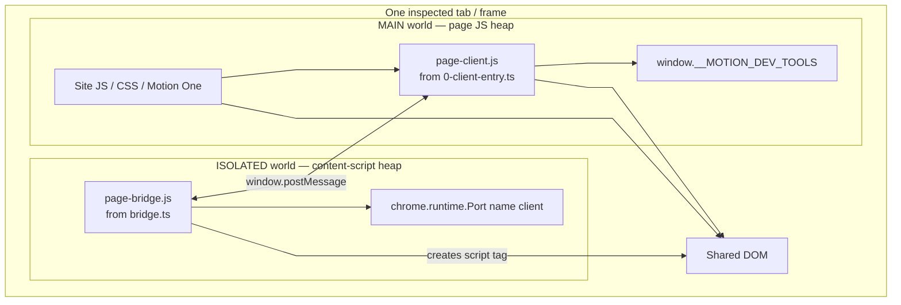
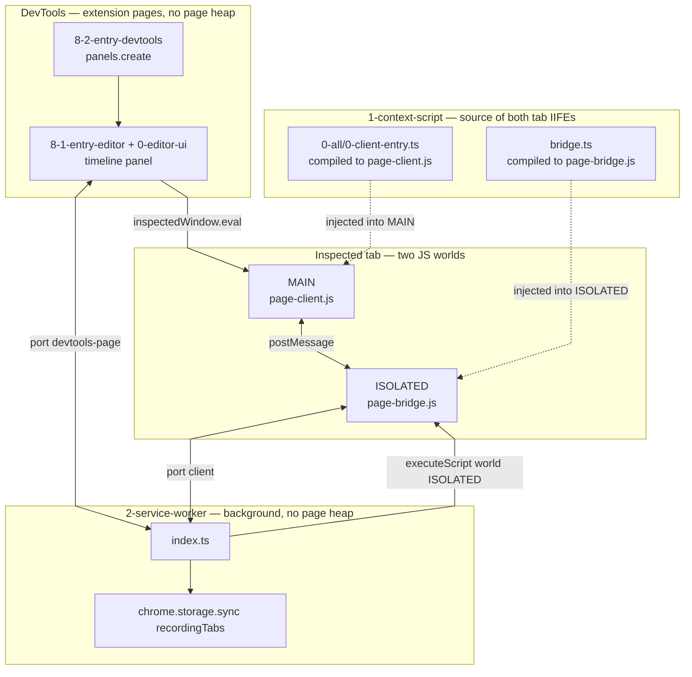
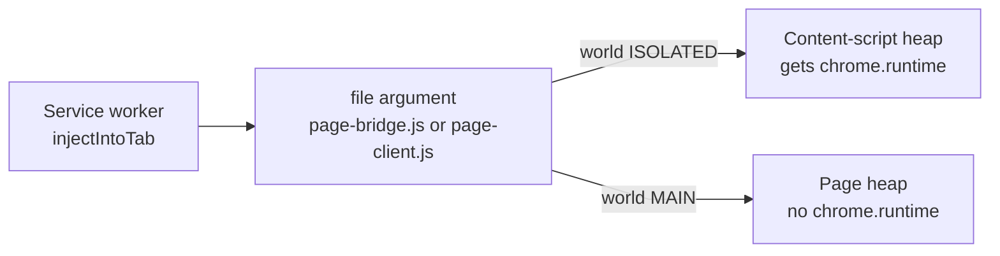
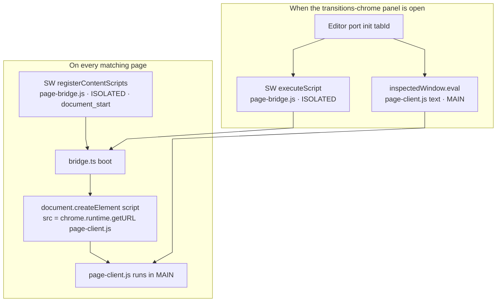
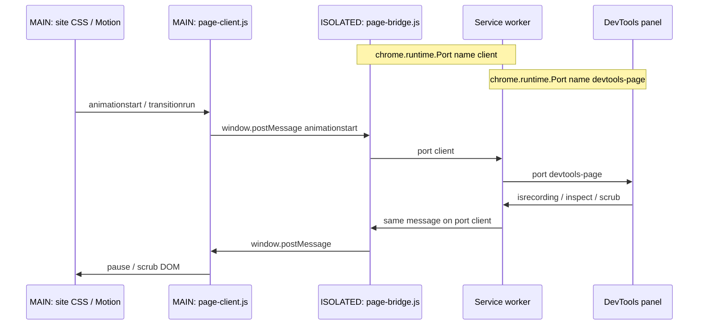
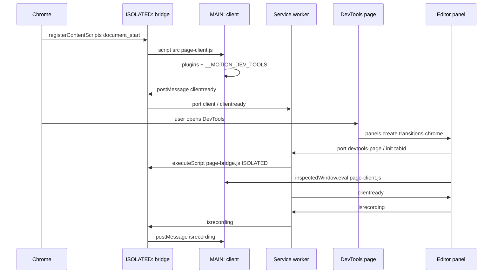

# MAIN world and isolated world

Chrome does not run every script on a tab in one `window`. Each frame has **two JavaScript heaps**. They share the **DOM**. They do not share `window` bindings, closures, or Chrome APIs.

`injectIntoTab` in `src/2-service-worker/index.ts` is how the service worker chooses which heap a file runs in:

```ts
function injectIntoTab(tabId: number, file: string, world: "MAIN" | "ISOLATED", frameId?: number)
```

That `world` argument is `chrome.scripting.executeScript({ world })`. It is **not** a flag for the service worker or DevTools. Those never become MAIN or isolated. They live in other Chrome processes and only *inject into* a tab world.

## The two heaps

| World | Chrome name | What it is | Has `chrome.runtime`? | Sees site JS / `getAnimations()`? |
| --- | --- | --- | --- | --- |
| **MAIN** | Page world | The inspected page’s own JS heap | No | Yes |
| **ISOLATED** | Content-script world | A hidden heap Chrome creates for this extension | Yes | No (same DOM, different `window`) |

Site code cannot read isolated-world variables. Isolated code cannot read `window.__MOTION_DEV_TOOLS` unless MAIN puts it there. The only cheap cross-heap channel on the tab is `window.postMessage` (plus the shared DOM).



## How the three extension surfaces map onto those worlds

`src/1-context-script` is the only folder that **runs inside the tab**. It is two IIFEs, one per world. The service worker and DevTools are **outside** the tab.



| Surface | Folder | Process | Relation to MAIN / isolated |
| --- | --- | --- | --- |
| Context script — client | `src/1-context-script/0-all/0-client-entry.ts` → `page-client.js` | Runs **in MAIN** | Must see real CSS / Motion animations and set `__MOTION_DEV_TOOLS_RECORD`. Must **not** call `chrome.*`. |
| Context script — bridge | `src/1-context-script/bridge.ts` → `page-bridge.js` | Runs **in ISOLATED** | The only tab script that can see both `window.postMessage` and `chrome.runtime`. Injects the client, then relays. |
| Service worker | `src/2-service-worker/index.ts` | Extension background | Port hub. Registers and re-injects the **isolated** bridge. Forwards messages. Never sees the page `window`. |
| DevTools bootstrap | `src/8-2-entry-devtools/index.ts` | Extension DevTools page | Creates the **transitions-chrome** panel. Not a page world. |
| Editor panel | `src/8-1-entry-editor` + `src/0-editor-ui` | Panel iframe | UI. Connects to the worker on port `devtools-page`. Can `inspectedWindow.eval` into **MAIN** (bypasses page CSP). |

The isolated world is the only participant that can talk to **both** the page and the extension APIs. MAIN can see animations but not `chrome`. The worker and DevTools can see `chrome` but not the page heap — that is why they inject or message, and never `import` the client as a normal module.

## What `injectIntoTab(..., world)` does

`chrome.scripting.executeScript` copies a file from the extension package into the chosen heap of a tab (or one frame).



This app currently only uses the isolated path from the worker:

```ts
function injectPageClient(tabId: number, frameId?: number) {
    return injectIntoTab(tabId, getPageBridgeFile(), "ISOLATED", frameId);
}
```

The helper is still named `injectPageClient`, but it injects **`page-bridge.js` into ISOLATED**. The MAIN-world client is pulled in next, by the bridge itself (or by DevTools). The `world: "MAIN"` type on `injectIntoTab` is Chrome’s API; the worker does not call it that way today.

Callers:

| When | Who | What gets injected | World |
| --- | --- | --- | --- |
| Extension load | `registerPageBridge()` | `page-bridge.js` via `registerContentScripts` | `ISOLATED`, `document_start`, all frames |
| DevTools panel sends `init` | `handleDevToolsPort` → `injectPageClient` | `page-bridge.js` via `executeScript` | `ISOLATED` |
| Top-level navigation while DevTools is attached | `clearTimelineOnReload` | `page-bridge.js` via `executeScript` | `ISOLATED` |
| Bridge boots | `bridge.ts` `injectPageClient()` | `<script src="page-client.js">` | Browser then runs that file in **MAIN** |
| Panel connects / navigates / `clientready` | `0-editor-ui/chrome/inject-client.ts` | `page-client.js` text via `inspectedWindow.eval` | **MAIN** |



`registerContentScripts` keeps the isolated bridge present even before DevTools opens. `executeScript` on `init` / reload covers frames that missed registration. `inspectedWindow.eval` is the CSP-safe backup for MAIN: page CSP can block a `<script src="chrome-extension://…">` tag; the DevTools protocol can still eval the IIFE into MAIN.

## Message path

Recording events start in MAIN (only MAIN sees `animationstart`). They cannot go straight to the worker. Isolated is the hop. The worker is the hop to DevTools.



Startup, with both worlds and DevTools:



## Why the split exists

| Need | Must run where | Why |
| --- | --- | --- |
| Hook `animationstart`, `getAnimations()`, Motion One | MAIN | Those objects live on the page heap. Isolated cannot see them. |
| Set `window.__MOTION_DEV_TOOLS_RECORD` | MAIN | Motion One on the site reads that global. |
| `chrome.runtime.connect({ name: "client" })` | ISOLATED (or extension pages) | MAIN has no `chrome.runtime`. |
| Hide the relay from site JS | ISOLATED | Site code must not call the port or spoof extension APIs. |
| Own recording flags, fan-in many frames | Service worker | Background lifetime; no tab `window`. |
| Timeline UI, `inspectedWindow` | DevTools panel | Extension page; can eval into MAIN and bypass CSP. |

The MAIN-world client must stay a **classic IIFE**. A Vite / CRXJS ES-module loader in MAIN resolves `import()` against the **page** origin, not the extension, so the recorder never starts. Isolated *can* use a Vite content-script loader (`chrome.runtime.getURL` exists there); this repo still ships the bridge as a plain IIFE so the HMR / webcomponents wrapper does not run on every inspected tab.
